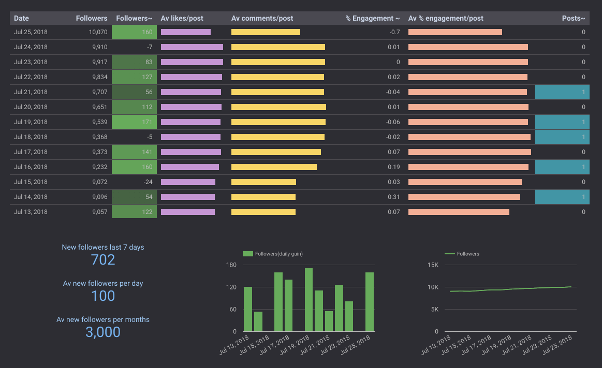

# Instagram-Fetcher

A Google Apps Script giving data about the last 12 posts of any Instagram user without using the API.

Then it's up to you to use Google Studio to build nice looking social media dashboards!

My coding creations: https://pascalguyon.org/programming/  
Join my 500k+ followers: https://twitter.com/pascalguyon
